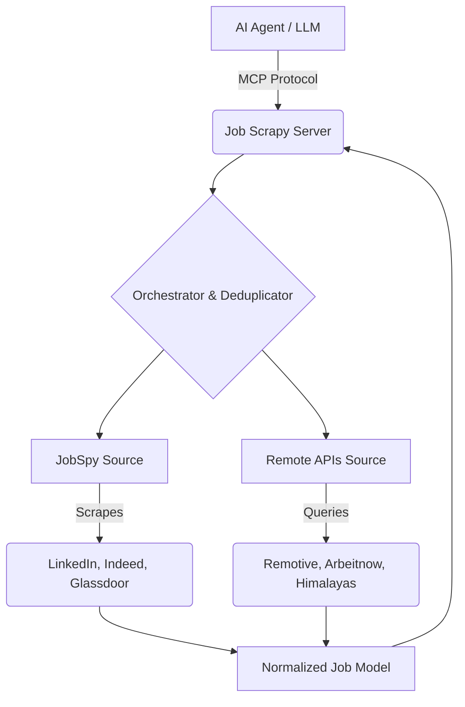

# Job Scrapy

An open-source MCP server for real-time job discovery across multiple job sources.

[](https://opensource.org/licenses/MIT)

## Demo
Watch the MCP server in action:


## Why Job Scrapy?
AI agents and LLMs are incredibly powerful, but their training data is static. If an AI is asked to "find jobs," it relies on outdated web data or hallucinates. **Job Scrapy** solves this by providing a Model Context Protocol (MCP) server that empowers AI agents to execute real-time searches across major job boards and remote APIs, ensuring accurate, up-to-the-minute job discovery.

## Features
- **Unified Job Model**: Normalizes disparate job postings into a consistent, strongly-typed format.
- **Robust Deduplication**: Intelligently removes duplicate listings using composite keys and URLs.
- **Concurrent Scraping**: Orchestrates searches across multiple sources simultaneously for speed.
- **MCP Native**: Exposes clean, descriptive tools that Claude, Antigravity, and other agents can consume natively via `stdio`.

## Architecture



## Supported Sources

**Implemented:**
- JobSpy (LinkedIn, Indeed, Glassdoor, ZipRecruiter)
- Remote APIs (Remotive, Arbeitnow, Himalayas)

## Installation

```bash
git clone https://github.com/BenMishal/job-scrapy.git
cd job-scrapy
pip install -r requirements.txt
```

*(Note: Docker is supported via the included `Dockerfile` but is not mandatory for normal usage).*

## Environment Variables
Copy the `.env.example` file to `.env`:
```bash
cp .env.example .env
```
Add your optional API keys for sources like Findwork or Adzuna. **Never commit your `.env` file to version control.**

## Connecting to AI Agents

### Claude Desktop
Add this to your `claude_desktop_config.json`:
```json
{
  "mcpServers": {
    "job-scrapy": {
      "command": "/path/to/your/python/environment/bin/python",
      "args": ["/path/to/job-scrapy/server.py"]
    }
  }
}
```

### Antigravity
Add this to your Antigravity `mcp_config.json`:
```json
{
  "mcpServers": {
    "job_scrapy": {
      "command": "/path/to/your/python/environment/bin/python",
      "args": ["/path/to/job-scrapy/server.py"]
    }
  }
}
```

## MCP Usage / Example Prompts
Once connected, try asking your AI:
- *"Find Business Analyst jobs in Dubai posted in the last 24 hours"*
- *"Find remote Python jobs posted in the last 24 hours"*
- *"Find Data Analyst jobs in Chennai"*

## Development & Testing
This project uses `pytest` for testing, `ruff` for linting, and `mypy` for type checking.

```bash
pip install -e ".[dev]"
pytest tests/
ruff check .
mypy src/job_scrapy
```

**Testing the Server Manually:**
```bash
npx @modelcontextprotocol/inspector mcp dev server.py
```

## Responsible Use
This project is an automation tool. Users are responsible for complying with the Terms of Service, robots.txt policies, and applicable laws of the job platforms they access. We do not implement CAPTCHA bypassing or anti-bot evasion techniques designed to defeat access controls.

## License
MIT License. See `LICENSE` for details.
